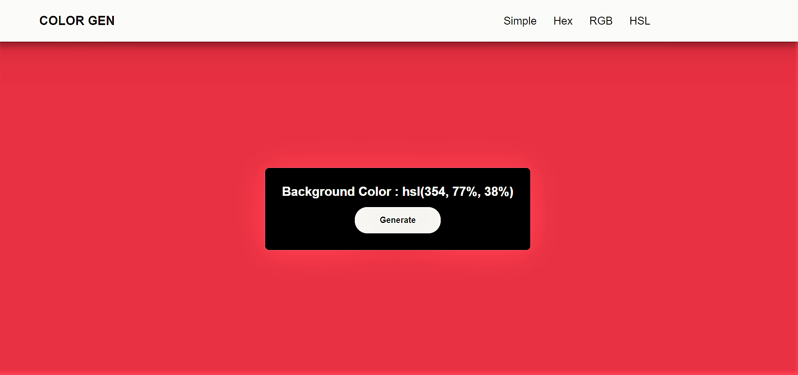

# Random color generator || Hex RGB HSL Simple

## Welcome! 👋

Hello! Thanks for cheking out this repository.

## What is it about

It's a random color generator made with vanilla JS. I've been learning basic javascript project form [jhon smilga's youtube course](https://youtu.be/3PHXvlpOkf4). I learned the simple and hex one from his tutorial. I did the rest on my own. I didn't focus on the ui much. The simple color array was copied form [here](https://gist.github.com/bobspace/2712980).

Here is my project site's url-
https://drougnov.github.io/random-color-generator/

## Built with

-HTML

-CSS

-Javascript

## Author

Facebook -[Biplob Barua Rocky] https://www.facebook.com/drougnov.bd.9

Frontend Mentor - https://www.frontendmentor.io/profile/Drougnov

### Any suggestion

I would be glad and greatful if you could leave any suggestion for this project or about anything else. Have a good day :)
